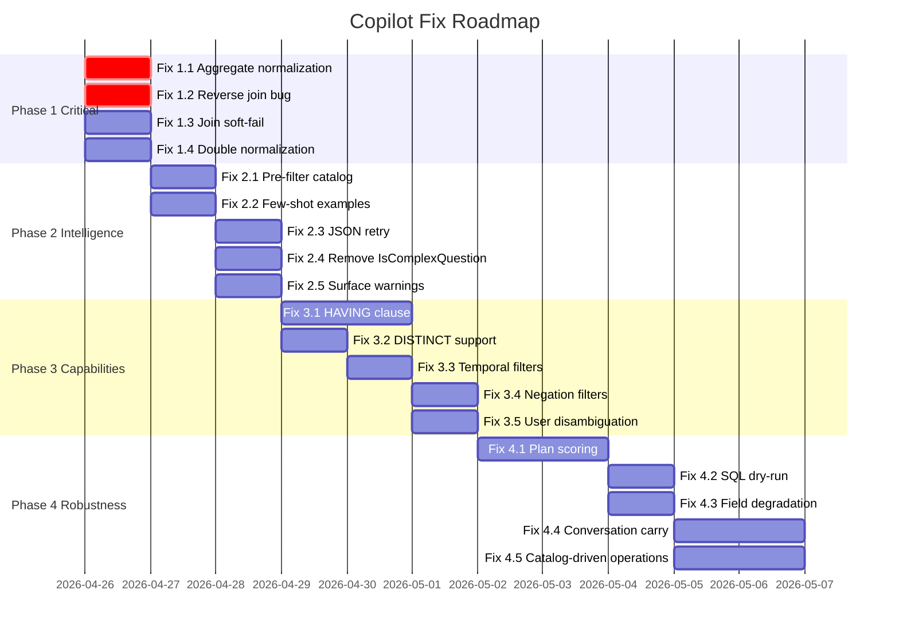

# 🛠️ Deep Action Plan — Copilot Data Query Engine

> 20 concrete fixes across 4 phases. Each fix has the exact file, line, what's wrong, and what to do.

---

## Phase 1: Critical Bugs (Day 1) — Prevent Wrong Results

### Fix 1.1: `NormalizeAggregateFunction` silently converts "average" to COUNT

**File:** [CopilotDataQueryExecutorService.cs](file:///c:/Work/Lern/Improve/v1/AISupportAnalysisPlatform/Services/AI/Copilot/Data/CopilotDataQueryExecutorService.cs#L652-L660)

**Bug:** The switch only handles `"avg"`, `"min"`, `"max"`, `"sum"`. Everything else (including `"average"`, `"count"`, `"mean"`) falls to `_ => "COUNT"`. If the AI model or the planner's `NormalizeAggregationType` outputs `"average"` instead of `"avg"`, the SQL silently does COUNT instead of AVG.

**Fix:**
```csharp
private static string NormalizeAggregateFunction(string function)
    => (function ?? "").Trim().ToLowerInvariant() switch
    {
        "avg" or "average" or "mean" => "AVG",
        "min" or "minimum" => "MIN",
        "max" or "maximum" => "MAX",
        "sum" or "total" => "SUM",
        "count" or "" => "COUNT",
        _ => "COUNT" // Log warning here
    };
```

---

### Fix 1.2: Reverse join path produces unresolvable joins

**File:** [CopilotDataIntentPlannerService.cs](file:///c:/Work/Lern/Improve/v1/AISupportAnalysisPlatform/Services/AI/Copilot/Data/CopilotDataIntentPlannerService.cs#L1033-L1051)

**Bug:** When `FindJoinPath` discovers a reverse relationship (entity B has a relationship pointing to entity A), it creates `FromEntity=A, ToEntity=B, Relationship=B's relationship name`. But `BuildJoinClauses` (executor L203) looks for that relationship on entity A — it doesn't exist there → returns null → entire query fails.

**Fix:** For reverse joins, swap the direction to match the entity that owns the relationship:
```csharp
// Instead of: FromEntity = current.Name, ToEntity = otherEntity.Name
// Use:        FromEntity = otherEntity.Name, ToEntity = current.Name
new() { 
    FromEntity = otherEntity.Name, 
    ToEntity = current.Name, 
    Relationship = relationship.Name 
}
```
Then in `BuildJoinClauses`, also search `target.Relationships` if `from.Relationships` has no match.

---

### Fix 1.3: `BuildJoinClauses` hard-fails on ANY bad join

**File:** [CopilotDataQueryExecutorService.cs](file:///c:/Work/Lern/Improve/v1/AISupportAnalysisPlatform/Services/AI/Copilot/Data/CopilotDataQueryExecutorService.cs#L193-L196)

**Bug:** `return null` kills the entire query if ONE join can't resolve — even when that join isn't needed for the selected fields.

**Fix:** Skip unresolvable joins with a warning instead of hard-failing:
```csharp
if (from == null || target == null || !aliases.TryGetValue(from.Name, out var fromAlias))
{
    continue; // Skip this join, don't kill the query
}
```

---

### Fix 1.4: `NormalizeAggregations` inconsistency with executor

**File:** [CopilotDataIntentPlannerService.cs](file:///c:/Work/Lern/Improve/v1/AISupportAnalysisPlatform/Services/AI/Copilot/Data/CopilotDataIntentPlannerService.cs#L674-L680)

**Bug:** The planner normalizes `"avg"` to `"average"` via `NormalizeAggregationType()`, but then the executor's `NormalizeAggregateFunction` doesn't handle `"average"`. This double-normalization mismatch causes AVG queries to silently become COUNT.

**Fix:** Use the SAME normalization in both places. The executor should accept whatever the planner outputs.

---

## Phase 2: Intelligence Layer (Days 2-3) — Make Planning Smarter

### Fix 2.1: Pre-filter catalog before sending to AI model

**File:** [CopilotDataIntentPlannerService.cs](file:///c:/Work/Lern/Improve/v1/AISupportAnalysisPlatform/Services/AI/Copilot/Data/CopilotDataIntentPlannerService.cs#L86-L95)

**Problem:** Sending 43KB of full catalog JSON. Local models can't process this well.

**Fix:** Build a `BuildRelevantCatalogContext(question, catalog)` method that:
1. Score each entity against the question using existing `ScoreEntityMatch`
2. Keep top 3-4 matching entities + their relationships
3. Serialize only those entities → ~3-5KB instead of 43KB

---

### Fix 2.2: Add few-shot examples to the AI prompt

**File:** [copilot-text.json](file:///c:/Work/Lern/Improve/v1/AISupportAnalysisPlatform/copilot-text.json#L138-L180)

**Problem:** The model has instructions but no examples. Local models need examples.

**Fix:** Add 4-5 example Q→JSON pairs at the end of the prompt covering: simple count, grouped breakdown, multi-entity join, aggregation with filter, and detail lookup.

---

### Fix 2.3: Add JSON retry on model parse failure

**File:** [CopilotDataIntentPlannerService.cs](file:///c:/Work/Lern/Improve/v1/AISupportAnalysisPlatform/Services/AI/Copilot/Data/CopilotDataIntentPlannerService.cs#L111-L112)

**Problem:** If JSON parsing fails, the model plan is discarded entirely.

**Fix:** Wrap deserialize in try/catch. On failure, try to extract partial JSON using `CopilotJsonHelper.ExtractJson` with relaxed parsing. If that also fails, try a second model call with a shorter prompt like "Fix this JSON: {raw}".

---

### Fix 2.4: Remove `IsComplexQuestion` gatekeeper

**File:** [CopilotDataIntentPlannerService.cs](file:///c:/Work/Lern/Improve/v1/AISupportAnalysisPlatform/Services/AI/Copilot/Data/CopilotDataIntentPlannerService.cs#L196-L212)

**Problem:** `IsComplexQuestion` uses a DIFFERENT keyword list than `ResolveOperation`, causing inconsistent routing. "total tickets" goes deterministic, "average resolution" goes to model.

**Fix:** Replace `IsComplexQuestion` with a smarter strategy: ALWAYS run both deterministic AND model planners in parallel. Then pick the better plan using a scoring function:
```csharp
var bestPlan = ScorePlan(deterministicPlan) >= ScorePlan(modelPlan) 
    ? deterministicPlan : modelPlan;
```
Score based on: has primary entity, has valid fields, has valid aggregations, no validation warnings.

---

### Fix 2.5: Surface `ValidationMessages` to the user

**File:** [PipelineFormatterService.cs](file:///c:/Work/Lern/Improve/v1/AISupportAnalysisPlatform/Services/AI/Copilot/Pipeline/Formatting/PipelineFormatterService.cs#L42-L45)

**Problem:** Validation warnings are collected but never shown. User gets "No data" with no explanation.

**Fix:** Append validation messages to the answer:
```csharp
if (context.DataIntentPlan.ValidationMessages.Count > 0)
{
    result.Answer += "\n\n⚠️ Notes: " + 
        string.Join("; ", context.DataIntentPlan.ValidationMessages);
}
```

---

## Phase 3: Query Capabilities (Days 4-6)

### Fix 3.1: Add HAVING clause support

**File:** [CopilotDataQueryExecutorService.cs](file:///c:/Work/Lern/Improve/v1/AISupportAnalysisPlatform/Services/AI/Copilot/Data/CopilotDataQueryExecutorService.cs#L696-L699)

**Why:** Can't answer "entities with more than 10 tickets" or "priorities with avg resolution > 24 hours".

**Fix:** Add `HavingFilters` to `CopilotDataIntentPlan`. In `CatalogSqlBuilder.Build()`, after GROUP BY, emit `HAVING` with the same parameterized predicate logic.

---

### Fix 3.2: Add DISTINCT support

**File:** [CopilotDataQueryExecutorService.cs](file:///c:/Work/Lern/Improve/v1/AISupportAnalysisPlatform/Services/AI/Copilot/Data/CopilotDataQueryExecutorService.cs#L684)

**Why:** "List users with tickets" produces duplicate rows without DISTINCT.

**Fix:** Add `bool UseDistinct` to the plan. In SQL builder: `SELECT {(useDistinct ? "DISTINCT " : "")}{topClause}...`

---

### Fix 3.3: Add temporal filter detection (deterministic)

**File:** [CopilotDataIntentPlannerService.cs](file:///c:/Work/Lern/Improve/v1/AISupportAnalysisPlatform/Services/AI/Copilot/Data/CopilotDataIntentPlannerService.cs#L430-L447)

**Why:** "Tickets created this week" or "last 30 days" can't be handled deterministically.

**Fix:** Add `ApplyTemporalFilters()` after `ApplyBooleanFilters()`. Use regex to detect "today", "this week", "last N days", "this month" → translate to `CreatedAt BETWEEN` filter using `DateTime.UtcNow`.

---

### Fix 3.4: Support NOT / negation filters

**File:** Add to `BuildFilterPredicates` in executor.

**Why:** "Tickets NOT assigned" or "tickets without attachments" can't be expressed.

**Fix:** Add `"notequals"` and `"isnull"` operators:
```csharp
case "notequals":
    predicates.Add(new($"{column} != {name}", new(name, filter.Value)));
    break;
case "isnull":
    predicates.Add(new($"{column} IS NULL"));
    break;
case "isnotnull":
    predicates.Add(new($"{column} IS NOT NULL"));
    break;
```

---

### Fix 3.5: User relationship disambiguation

**File:** [CopilotDataQueryExecutorService.cs](file:///c:/Work/Lern/Improve/v1/AISupportAnalysisPlatform/Services/AI/Copilot/Data/CopilotDataQueryExecutorService.cs#L203-L206)

**Why:** Ticket has 3 User relationships (AssignedTo, CreatedBy, ResolvedBy). Current code picks the first match.

**Fix:** In `BuildJoinClauses`, when the plan specifies a relationship name, use ONLY that name. The fallback to `rel.Target.Equals(target)` should only trigger when no relationship name is specified.

---

## Phase 4: Robustness (Days 7-10)

### Fix 4.1: Plan scoring and selection

**File:** [CopilotDataIntentPlannerService.cs](file:///c:/Work/Lern/Improve/v1/AISupportAnalysisPlatform/Services/AI/Copilot/Data/CopilotDataIntentPlannerService.cs#L56-L68)

**Fix:** New method `ScorePlan(plan, catalog)`:
```
+5  has valid PrimaryEntity
+3  per valid field ref
+3  per valid filter
+5  has aggregation matching a catalog capability
+2  has explicit joins
-5  per validation warning
-10 requiresClarification
```
Always build both plans. Pick highest score.

---

### Fix 4.2: SQL dry-run validation

**File:** [CopilotDataQueryExecutorService.cs](file:///c:/Work/Lern/Improve/v1/AISupportAnalysisPlatform/Services/AI/Copilot/Data/CopilotDataQueryExecutorService.cs#L54-L58)

**Fix:** Before executing, do `SET FMTONLY ON; {sql}; SET FMTONLY OFF;` or `sp_describe_first_result_set`. This validates SQL syntax without running the query. If it fails, return a clear error instead of crashing.

---

### Fix 4.3: Graceful field degradation

**File:** [CopilotDataQueryExecutorService.cs](file:///c:/Work/Lern/Improve/v1/AISupportAnalysisPlatform/Services/AI/Copilot/Data/CopilotDataQueryExecutorService.cs#L260-L311)

**Problem:** If 1 of 5 fields can't resolve, the whole projection is empty → query fails.

**Fix:** `BuildFieldProjection` already returns null for bad fields. The issue is that `BuildProjections` doesn't add defaults when most fields fail. Add: if projections < 2, add primary entity default fields as fallback.

---

### Fix 4.4: Conversation context carry-forward for data

**File:** New logic in `PipelineAnalyzerService.cs`

**Why:** "Show Critical tickets" → works. "Now filter to just open ones" → fails.

**Fix:** Before building a new plan, check `questionContext.IsFollowUp`. If true, load the previous `CopilotDataIntentPlan` from conversation state and merge the new filters/sorts into it rather than building from scratch.

---

### Fix 4.5: Catalog-driven operation resolution

**File:** [CopilotDataIntentPlannerService.cs](file:///c:/Work/Lern/Improve/v1/AISupportAnalysisPlatform/Services/AI/Copilot/Data/CopilotDataIntentPlannerService.cs#L258-L282)

**Problem:** `ResolveOperation` uses hardcoded regex — violates the requirements.

**Fix:** Move operation keywords INTO the catalog JSON under `AllowedOperations` with aliases:
```json
"allowedOperations": [
  { "name": "Count", "aliases": ["count", "how many", "total", "number of"] },
  { "name": "Breakdown", "aliases": ["by", "per", "compare", "group"] },
  { "name": "List", "aliases": ["show", "list", "find", "get"] }
]
```
Then `ResolveOperation` iterates the catalog operations and matches aliases dynamically.

---

## Priority Execution Order



---

## Expected Impact

| After Phase | Score | Improvement |
|:---|:---|:---|
| Current | **55/100** | — |
| Phase 1 | **65/100** | No more silent wrong results |
| Phase 2 | **75/100** | Model produces usable plans 2-3x more often |
| Phase 3 | **82/100** | Handles temporal, negation, HAVING queries |
| Phase 4 | **90/100** | Self-correcting, conversation-aware, no hardcoding |
